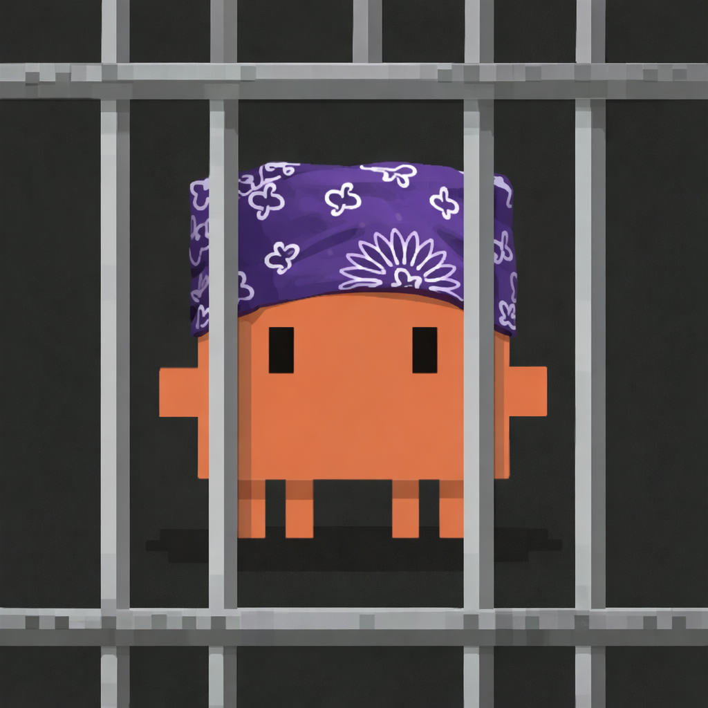

# claude-jail



Anthropic's provided dev container not only is completly out of date and still uses the depricated npm install.
It also just leaves a lot to be desired. 


### What is this for

- Run claude code in a locked down safe environment
- Use `--allow-dangerously-skip-permissions` without fear
- Includes a firewall sh file for further safety that you can toggle on and off

### Docker Compose

Build from `docker/` and customize the volume mounts for your setup. The compose file defines two profiles:

- **sandbox** — Firewall locked down, no internet access. Safe for `--allow-dangerously-skip-permissions`.
- **pair** — Full network access with project mounts and persistent credentials for interactive pairing.

Here's a full example `docker-compose.yaml`:

```yaml
x-common: &common
  image: claude_code:latest
  build: .
  user: "1000:1000"                # Run as non-root claude user (must match Dockerfile UID/GID)
  restart: unless-stopped
  environment:
    - TERM=xterm-256color          # Terminal color support
    - COLORTERM=truecolor
    - FORCE_COLOR=1
    - CLAUDE_CONFIG_DIR=/home/claude/.claude  # Where Claude looks for config inside the container
  stdin_open: true                 # Keep stdin open for interactive use
  tty: true                       # Allocate a pseudo-TTY
  cap_add:
    - NET_ADMIN                    # Required for the optional iptables firewall (init-firewall.sh)

services:
  sandbox:
    <<: *common
    container_name: claude_sandbox
    command: sudo /usr/local/bin/init-firewall.sh --lockdown
    profiles:
      - sandbox
    volumes:
      # Config — share your Claude auth/settings so you don't need to re-authenticate
      - /path/to/.claude:/home/claude/.claude
      - /path/to/.claude.json:/home/claude/.claude/.claude.json

  pair:
    <<: *common
    container_name: claude_pair
    # command: sudo /usr/local/bin/init-firewall.sh
    profiles:
      - pair
    volumes:
      # Project directories — mount your host projects into the container
      - /path/to/my-project:/home/claude/projects/my-project
      - /path/to/another-project:/home/claude/projects/another-project
      # Config — share your Claude auth/settings so you don't need to re-authenticate
      - /path/to/.claude:/home/claude/.claude
      - /path/to/.claude.json:/home/claude/.claude/.claude.json
      # Persist gh CLI auth across container restarts
      - /path/to/.config/gh:/home/claude/.config/gh
```

Build and start a container:

```bash
cd docker
docker compose build

# Start the sandbox (locked-down network)
docker compose --profile sandbox up -d

# Or start the pair container (full network)
docker compose --profile pair up -d
```

Attach to a running container:

```bash
docker exec -it claude_sandbox /bin/zsh
# or
docker exec -it claude_pair /bin/zsh
```
